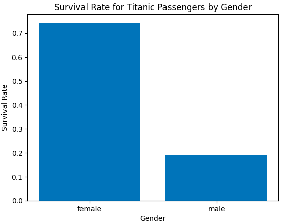
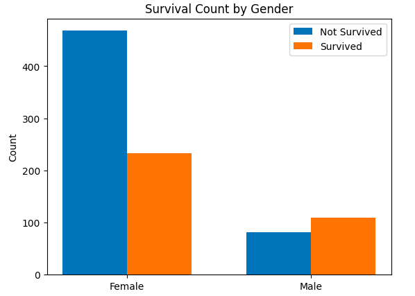
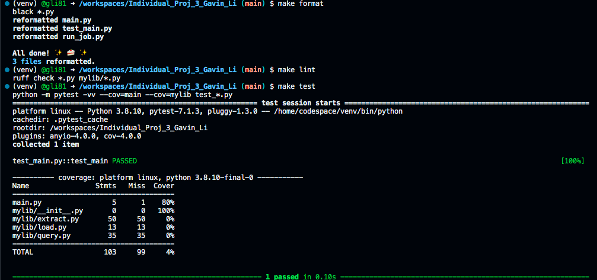

# IDS 706 Data Engineering Individual Project 3
Gavin Li `gl183`

## Purpose of the project
The purpose of this project is to build an ETL data pipeline on Databricks, automate the workflow on the platform, then find some insights from the data.

## Video explanation

## ETL data pipeline

- [E]xtract

  Retrived the data from the data source using python `requests` package, then stored the data in databricks using the `dbfs` protocol as a `.csv` file.

- [T]ransform

  Dropped unnecessary columns, leaving only the variables that are useful to later analysis (e.g., `Survived`, `Sex`, `Pclass`)

- [L]oad

  Loaded the transformed data set into a delta lake table as a data sink.

## Insight, Data visualization, Conclusion

- Visualization 1: Survival rate of Titanic passengers by gender

- Visualization 2: Count of survived / not survived of Titanic passengers by gender

## Databricks Workflow

- Automated trigger

## Result of `make format`, `make lint`, `make test`

## Reference
[Professor Noah's ruff template](https://github.com/nogibjj/python-ruff-template)